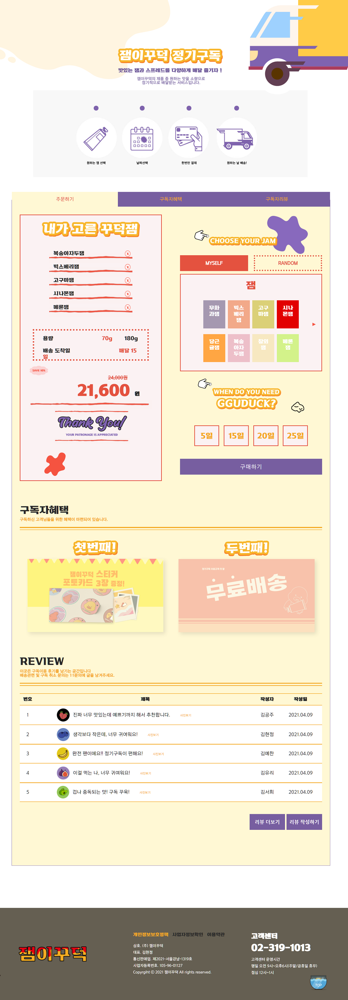

## <잼이꾸덕> 정기구독페이지
  
  
  #### 개발환경💻  

  </a>
   </a>
    </a>
    </a> 
  #### 프로젝트 소개 💬  
    팀플로 진행된 브랜딩 작업물입니다. 직접 기획부터 디자인 코딩까지 팀원들과 함께 제작해 나갔습니다.
    그 중 브랜드의 제품을 정기구독 할 수 있는 페이지로, 미디어쿼리를 이용하여 모바일기기에 대응 할 수 있도록 하였습니다. 
    맛선택/랜덤 => 잼/스프레드 를 5개까지 선택 할 수 있고 맛을 변경할 수 있도록 삭제버튼을 추가해두었습니다
    또 배송날짜를 지정된 날중에 골라 설정 하며 가격이 바로 아래 안내됩니다.
    
 
